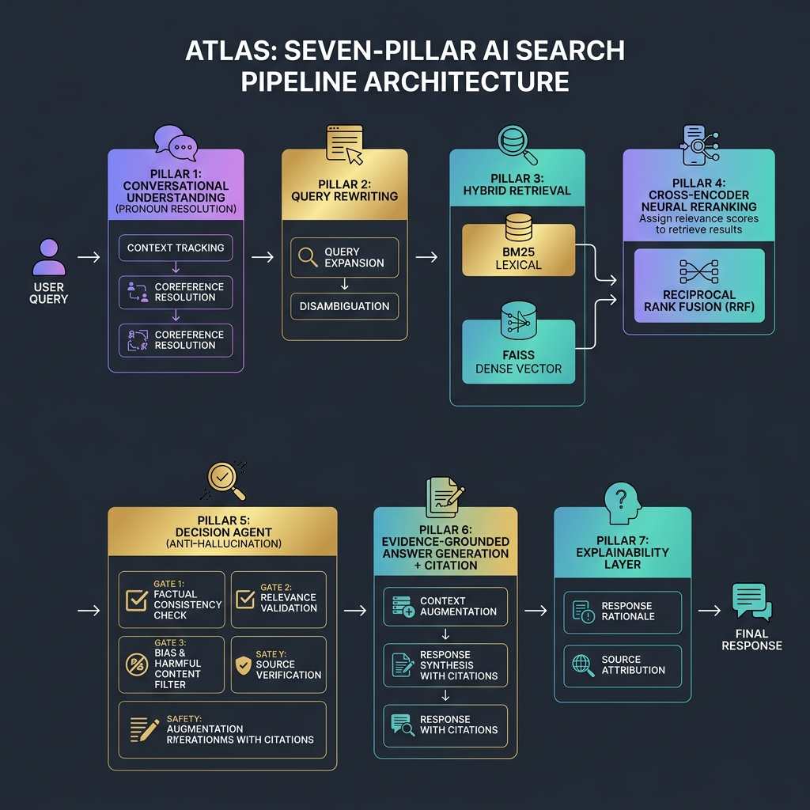

<p align="center">
  
</p>

<h1 align="center">🛰️ ATLAS</h1>
<h3 align="center">Adaptive Trustworthy Language-Augmented Search</h3>

<p align="center">
  <em>A 7-Pillar Hybrid RAG System for Multi-Domain Conversational Information Retrieval<br/>with Anti-Hallucination Guardrails and Full Pipeline Explainability</em>
</p>

<p align="center">
  
  
  
  
  
  
</p>

<p align="center">
  
  
  
</p>

---

## 📋 Table of Contents

- [Overview](#-overview)
- [Key Features](#-key-features)
- [System Architecture](#-system-architecture--7-pillar-pipeline)
- [Screenshots](#-screenshots)
- [Installation](#-installation)
- [How to Run](#-how-to-run)
- [Running Tests](#-running-stress--demonstration-tests)
- [Project Structure](#-project-structure)
- [Dataset](#-dataset)
- [Team](#-team)
- [Acknowledgements](#-acknowledgements)

---

## 🧠 Overview

**ATLAS** (Adaptive Trustworthy Language-Augmented Search) is an advanced Retrieval-Augmented Generation (RAG) system purpose-built for **multi-turn conversational search** across heterogeneous document domains. Unlike conventional RAG pipelines that suffer from contextual drift, hallucination, and opacity, ATLAS implements a rigorous **7-pillar architecture** that ensures every answer is evidence-grounded, every decision is explainable, and every out-of-domain query is safely intercepted.

Built for the **IBM Research Mt-RAG (SemEval 2026)** conversational benchmark, ATLAS processes **366,479 passages** spanning Government policy, Finance, Cloud technology, and Wikipedia knowledge bases — delivering sub-second retrieval on consumer-grade CPU hardware.

### 🔑 Why ATLAS?

| Problem | How ATLAS Solves It |
|---|---|
| **Pronoun drift** in multi-turn conversations | Dual-channel context tracker resolves pronouns to the correct referent |
| **Hallucinated answers** when evidence is insufficient | 4-gate Decision Agent intercepts unsupported queries |
| **Black-box retrieval** with no audit trail | Full 7-pillar pipeline telemetry with real-time explainability |
| **Single-method retrieval** misses relevant documents | Hybrid BM25 + Dense FAISS search with Reciprocal Rank Fusion |

---

## ✨ Key Features

- 🔍 **Hybrid Retrieval Engine** — Combines BM25 lexical search with FAISS dense vector similarity, merged via Reciprocal Rank Fusion (RRF)
- 🧠 **Conversational Query Understanding** — Dual-channel pronoun resolution tracks user subjects and proper nouns across turns
- 🔄 **Intelligent Query Rewriting** — Automatically rewrites follow-up queries into standalone, self-contained queries
- ⚡ **Neural Cross-Encoder Reranking** — `ms-marco-MiniLM-L-6-v2` reranker produces fine-grained relevance logit scores
- 🛡️ **Anti-Hallucination Decision Agent** — 4 safety gates: threshold check, score-gap ambiguity, semantic overlap, and named-entity consistency
- 📝 **Evidence-Grounded Answers** — Sliding-window sentence scorer extracts the optimal 2–3 sentence evidence window (zero generative hallucination)
- 🔗 **Full Citation Provenance** — Every answer links to its exact source passage ID, domain, and retrieval method
- 💡 **Complete Explainability Layer** — Human-readable reasoning for every pipeline decision
- 🎨 **Premium Glassmorphic UI** — Luxury 3-split dashboard with live pipeline telemetry, cosmic dark theme, and animated particle background
- ⚡ **Quick Command Center** — Floating command palette with one-click benchmark tests

---

## 🏗️ System Architecture — 7-Pillar Pipeline

<p align="center">
  
</p>

The ATLAS pipeline processes every query through seven distinct pillars:

```
User Query
    │
    ▼
┌─────────────────────────────────────────┐
│  Pillar 1: Conversational Understanding │  ← Dual-channel entity tracking
│  Pillar 2: Query Rewriting              │  ← Pronoun → referent substitution
└───────────────┬─────────────────────────┘
                │
                ▼
┌─────────────────────────────────────────┐
│  Pillar 3: Hybrid Retrieval             │
│  ┌──────────┐   ┌──────────────────┐    │
│  │  BM25    │ + │  FAISS Dense     │    │  ← 384-D MiniLM-L6-v2 embeddings
│  │ (Top 50) │   │ (Top 50)         │    │
│  └────┬─────┘   └───────┬──────────┘    │
│       └────────┬────────┘               │
│                ▼                        │
│     Reciprocal Rank Fusion (k=60)       │  ← Top 20 fused candidates
└───────────────┬─────────────────────────┘
                │
                ▼
┌─────────────────────────────────────────┐
│  Cross-Encoder Reranking                │  ← ms-marco-MiniLM-L-6-v2
│  (Top 10 → Logit Scores: -10 to +10)   │
└───────────────┬─────────────────────────┘
                │
                ▼
┌─────────────────────────────────────────┐
│  Pillar 4: Decision Agent               │
│  ┌──────────────────────────────────┐   │
│  │ Gate 1: Domain Threshold Check   │   │
│  │ Gate 2: Score-Gap Ambiguity      │   │
│  │ Gate 3: Semantic Overlap         │   │
│  │ Gate 4: Named-Entity Consistency │   │
│  └──────────────────────────────────┘   │
│       APPROVED ✅  │  INTERCEPTED 🛑    │
└───────────────┬─────────────────────────┘
                │
                ▼
┌─────────────────────────────────────────┐
│  Pillar 5: Evidence-Grounded Generation │  ← Sliding-window sentence scorer
│  Pillar 6: Citation Highlighting        │  ← Source passage ID + domain
│  Pillar 7: Explainability Layer         │  ← Human-readable audit trail
└───────────────┬─────────────────────────┘
                │
                ▼
          Final Response
    (Answer + Citation + Telemetry)
```

---

## 📸 Screenshots

### Main Dashboard — 3-Split Workspace

The ATLAS interface features a luxury 3-panel layout: the **dark onyx sidebar** for domain selection and scenario threads, the **cosmic violet conversation panel** for interactive querying, and the **warm beige pipeline auditor** for real-time telemetry.

<p align="center">
  
</p>

### Pipeline Auditor — Live Telemetry Trace

Every query triggers a detailed 6-step pipeline trace showing: query rewriting with pronoun resolution, hybrid retrieval stats, cross-encoder reranking scores, decision agent verdict, evidence-grounded citation, and a full explainability report.

<p align="center">
  
</p>

### Anti-Hallucination Interception

When the Decision Agent determines insufficient evidence (e.g., out-of-domain queries), the query is safely **intercepted** and a fallback message is returned instead of a fabricated answer.

<p align="center">
  
</p>

---

## 🛠️ Installation

### Prerequisites

| Requirement | Version |
|---|---|
| **Python** | 3.10 or 3.11 |
| **OS** | Windows 10/11 |
| **Shell** | PowerShell or Command Prompt |

### Step 1 — Clone the Repository

```bash
git clone https://github.com/Asma-Shoukat/ATLAS.git
cd ATLAS
```

### Step 2 — Create a Virtual Environment

```bash
python -m venv venv
```

### Step 3 — Activate the Virtual Environment

**PowerShell:**
```powershell
.\venv\Scripts\Activate.ps1
```

**Command Prompt:**
```cmd
.\venv\Scripts\activate.bat
```

### Step 4 — Install PyTorch (CPU Version)

```bash
pip install torch==2.1.2 --index-url https://download.pytorch.org/whl/cpu
```

### Step 5 — Install Dependencies

```bash
pip install SentenceTransformers==2.5.1 faiss-cpu==1.7.4 rank-bm25==0.2.2 Flask==3.0.2 flask-cors==4.0.0 numpy==1.26.4
```

> **Note:** The corpus data files (`Corpora/`, `Cache_Storage/`, `Conversations/`) are not included in this repository due to their large size (~1.2 GB). Please contact the authors for access to the dataset files, or follow the data preparation instructions in `docs/`.

---

## 🚀 How to Run

### Method A: One-Click Startup (Recommended)

Simply double-click the **`run.bat`** file in the project root. It will automatically:

1. ⚡ Kill any zombie Flask processes from previous sessions
2. 🖥️ Launch the Flask backend server in a minimized console window
3. 🌐 Open the interactive telemetry dashboard in your default browser

### Method B: Manual Startup

**1. Start the Backend:**
```bash
venv\Scripts\python.exe backend\app.py
```
> Wait for the console log to print `[System Operational] Local FAISS index loaded with global mapping. (100%)`

**2. Open the Frontend:**

Navigate to the `frontend/` folder and open `index.html` in any browser.

### Method C: Python Launcher

```bash
python launcher.py
```
This will automatically start the backend, wait for Flask to bind, and open the frontend.

---

## 📊 Running Stress & Demonstration Tests

Make sure the Flask backend is running, then execute any of the following test scripts in a separate terminal:

| Test | Command | Description |
|---|---|---|
| **Basic Search** | `venv\Scripts\python.exe tests\test_search.py` | Multi-domain search across all tenants |
| **4-Pillar Wildfire** | `venv\Scripts\python.exe tests\test_4pillars_wildfire.py` | Multi-turn conversational scenario with pronoun resolution |
| **Context Drift** | `venv\Scripts\python.exe tests\test_drifts.py` | Tests pronoun drift across topic switches |
| **Financial NAV** | `venv\Scripts\python.exe tests\test_fiqa_nav.py` | Financial asset query with entity guard |

---

## 📂 Project Structure

```
ATLAS/
├── backend/
│   └── app.py                    # Flask REST API — 7-pillar pipeline engine (1,042 lines)
├── frontend/
│   ├── index.html                # Premium 3-split glassmorphic dashboard
│   ├── style.css                 # 2,229-line luxury CSS with cosmic theme
│   ├── app.js                    # Frontend logic — telemetry rendering & chat engine
│   └── glowing_orb.png           # Decorative background asset
├── tests/
│   ├── test_search.py            # Basic multi-domain search validation
│   ├── test_4pillars_wildfire.py # 4-pillar conversational wildfire scenario
│   ├── test_drifts.py            # Pronoun/context drift stress test
│   └── test_fiqa_nav.py          # Financial domain entity guard test
├── scripts/                      # Diagnostic & data inspection utilities
├── docs/
│   ├── ATLAS_Academic_Report.md  # Full academic evaluation report
│   ├── ATLAS_Academic_Report.pdf # PDF version of the report
│   └── screenshots/              # UI screenshots for documentation
├── Cache_Storage/                # [NOT IN REPO] Binary caches (BM25, FAISS, models)
├── Corpora/                      # [NOT IN REPO] Source documents (GOVT, FIQA, CLOUD, CLAPNQ)
├── Conversations/                # [NOT IN REPO] Reference evaluation data
├── launcher.py                   # Python master launcher script
├── run.bat                       # Windows one-click startup script
├── .gitignore                    # Git exclusion rules
└── README.md                     # This file
```

---

## 📊 Dataset

ATLAS was evaluated on the **IBM Research Mt-RAG (SemEval 2026)** conversational benchmark:

| Domain | Source | Passages |
|---|---|---|
| 🏛️ **Government (GOVT)** | NASA Space Missions, FEMA Disaster Safety & Public Policy | 49,607 |
| 💰 **Finance (FIQA)** | Financial News Analyst Reports & Q&A Forums | 61,022 |
| ☁️ **Cloud (CLOUD)** | IBM Cloudant Technical Manuals & Cloud Developer Docs | 72,442 |
| 📚 **Wikipedia (CLAPNQ)** | General Knowledge Factoid Q&A & World History | 183,408 |
| **Total** | **Multi-Domain Corpus** | **366,479** |

### Domain-Calibrated Thresholds

The Decision Agent uses per-domain confidence thresholds calibrated for the `ms-marco-MiniLM-L-6-v2` cross-encoder:

| Domain | Threshold | Rationale |
|---|---|---|
| CLOUD | -2.0 | Technical docs with rich lexical overlap |
| GOVT | -1.5 | Policy documents with moderate specificity |
| CLAPNQ | -2.0 | Broad encyclopedic content |
| FIQA | +2.0 | Financial domain requires high precision |

---

## 🧪 Evaluation Results

### ✅ Approved Queries

| Scenario | Query | Confidence | Threshold | Verdict |
|---|---|---|---|---|
| GOVT Wildfire | "Which state has more wildfires?" | 3.847 | -1.5 | ✅ APPROVED |
| Pronoun Resolution | "What causes them?" → "What causes wildfires?" | 3.363 | -1.5 | ✅ APPROVED |
| FIQA Market Cap | "What's the difference between Market Cap and NAV?" | 7.431 | +2.0 | ✅ APPROVED |
| Short Query | "Which is more important?" → "...regarding Market Cap and NAV?" | 4.652 | +2.0 | ✅ APPROVED |

### 🛑 Intercepted Queries (Anti-Hallucination)

| Scenario | Query | Confidence | Reason |
|---|---|---|---|
| Intent Attack | "How do you bake a vanilla wedding cake?" | -10.161 | Below threshold + ambiguous + low overlap |
| Entity Guard | "What is the NAV of Apple?" | -0.856 | Below threshold + "Apple" not in passage |

---

## 🔧 Tech Stack

| Component | Technology |
|---|---|
| **Backend** | Python 3.10+, Flask 3.0, Flask-CORS |
| **Embedding Model** | `all-MiniLM-L6-v2` (384-D, SentenceTransformers) |
| **Reranker** | `ms-marco-MiniLM-L-6-v2` (Cross-Encoder) |
| **Vector Index** | FAISS Inner Product (flat IP) |
| **Lexical Search** | BM25 Okapi (rank-bm25) |
| **Fusion** | Reciprocal Rank Fusion (k=60) |
| **Tensor Framework** | PyTorch 2.1 (CPU) |
| **Frontend** | HTML5, CSS3 (Glassmorphism), Vanilla JS |
| **Fonts** | Outfit + Inter (Google Fonts) |
| **Icons** | Font Awesome 6.4 |

---

## 👥 Team

| Name | Student ID | Contribution |
|---|---|---|
| **Asma Shoukat** | 241418 | Core backend search architecture — hybrid retrieval engine (BM25 + FAISS), Reciprocal Rank Fusion merger, Cross-Encoder neural reranker integration, and domain safety threshold calibration |
| **Amna-tuz-Zahra** | 241382 | Dialogue state tracking and UI development — dual-channel context tracker for coreference resolution, responsive glassmorphic web interface with live pipeline telemetry, and sliding-window sentence extractor for citation highlighting |

**Department of Creative Technologies, Air University, Islamabad**  
**Course:** Information Retrieval (IR) | **Session:** June 2026

---

## 🙏 Acknowledgements

- **IBM Research** for the Mt-RAG (SemEval 2026) benchmark dataset
- **Hugging Face** for SentenceTransformers and Cross-Encoder model hosting
- **Meta AI Research** for the FAISS vector similarity search library
- **Google Fonts** for the Outfit and Inter typefaces

---

<p align="center">
  <sub>Built with ❤️ at Air University, Islamabad — June 2026</sub>
</p>
