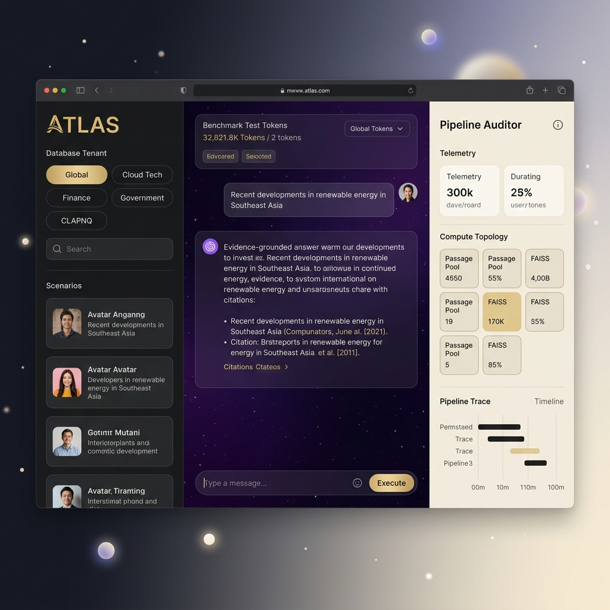
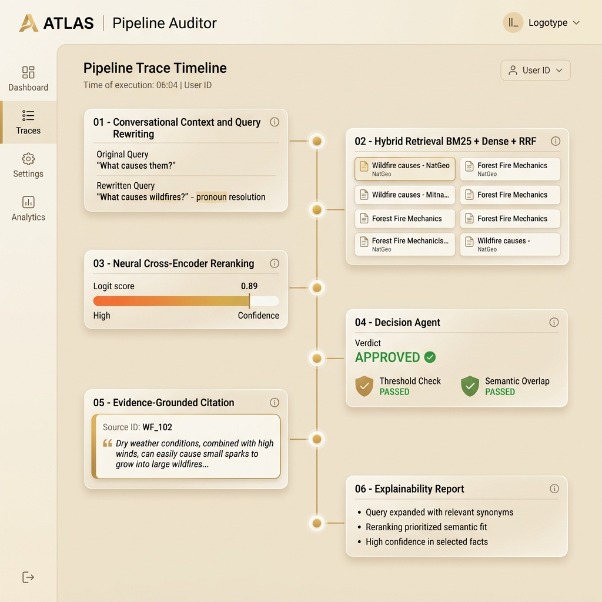
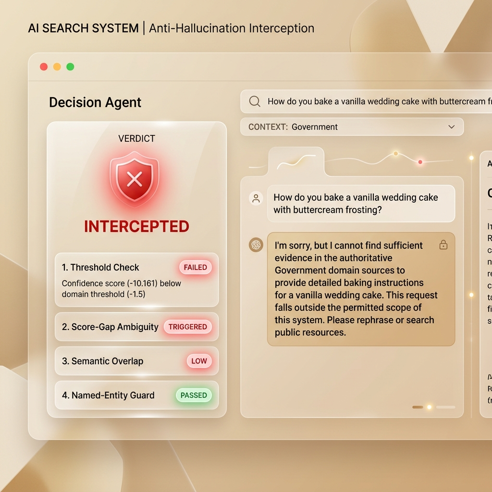

<h1 align="center"><strong>ATLAS — Adaptive Trustworthy Language-Augmented Search</strong></h1>
<p align="center"><strong>A 7-Pillar Hybrid RAG System for Multi-Domain Conversational Information Retrieval<br/>with Anti-Hallucination Guardrails and Full Pipeline Explainability</strong></p>

<p align="center">
  
</p>

<p align="center">
  
  
  
  
  
</p>

---

## Overview

**ATLAS** is a Retrieval-Augmented Generation (RAG) system designed for multi-turn conversational search across heterogeneous document domains. It implements a **7-pillar architecture** ensuring every answer is evidence-grounded, every decision is explainable, and every out-of-domain query is safely intercepted.

Built for the **IBM Research Mt-RAG (SemEval 2026)** benchmark — **366,479 passages** across Government, Finance, Cloud, and Wikipedia domains with sub-second retrieval on CPU.

| Problem | Solution |
|---|---|
| Pronoun drift in multi-turn conversations | Dual-channel context tracker resolves pronouns to correct referents |
| Hallucinated answers on insufficient evidence | 4-gate Decision Agent intercepts unsupported queries |
| Black-box retrieval with no audit trail | Full pipeline telemetry with real-time explainability |
| Single-method retrieval misses documents | Hybrid BM25 + FAISS with Reciprocal Rank Fusion |

---

## System Architecture

```
User Query
    │
    ├── Pillar 1–2: Conversational Understanding + Query Rewriting
    │         Dual-channel pronoun resolution
    │
    ├── Pillar 3: Hybrid Retrieval
    │         BM25 (Top 50) + FAISS Dense (Top 50) → Reciprocal Rank Fusion (k=60)
    │
    ├── Cross-Encoder Reranking
    │         ms-marco-MiniLM-L-6-v2 → Logit scores (-10 to +10)
    │
    ├── Pillar 4: Decision Agent (Anti-Hallucination)
    │         4 gates: Threshold · Score-Gap · Semantic Overlap · Entity Guard
    │         → APPROVED or INTERCEPTED
    │
    ├── Pillar 5–6: Evidence Extraction + Citation
    │         Sliding-window sentence scorer → Source passage ID
    │
    └── Pillar 7: Explainability Layer
              Human-readable audit trail for every decision
```

---

## Screenshots

<table>
  <tr>
    <td align="center"><strong>Pipeline Auditor — Live Telemetry</strong></td>
    <td align="center"><strong>Anti-Hallucination Interception</strong></td>
  </tr>
  <tr>
    <td></td>
    <td></td>
  </tr>
</table>

---

## Installation & Setup

**Prerequisites:** Python 3.10+ on Windows.

```bash
# Clone the repository
git clone https://github.com/Asma-Shoukat/ATLAS.git
cd ATLAS

# Create and activate virtual environment
python -m venv venv
.\venv\Scripts\Activate.ps1          # PowerShell
# .\venv\Scripts\activate.bat        # CMD alternative

# Install PyTorch (CPU) and dependencies
pip install torch==2.1.2 --index-url https://download.pytorch.org/whl/cpu
pip install SentenceTransformers==2.5.1 faiss-cpu==1.7.4 rank-bm25==0.2.2 Flask==3.0.2 flask-cors==4.0.0 numpy==1.26.4
```

> Corpus data files (`Corpora/`, `Cache_Storage/`, `Conversations/`) are not included due to size (~1.2 GB). Contact the authors for dataset access.

---

## Usage

Double-click **`run.bat`** in the project root. It will:

1. Kill any stale Flask processes on port 5000
2. Launch the Flask backend in a background console
3. Open the dashboard (`frontend/index.html`) in your browser

Wait for **"ATLAS PIPELINE ACTIVE"** in the pipeline auditor before submitting queries.

**Running Tests** — with the backend running, open a separate terminal:

```bash
venv\Scripts\python.exe tests\test_4pillars_wildfire.py    # Multi-turn wildfire scenario
venv\Scripts\python.exe tests\test_search.py               # Multi-domain search
venv\Scripts\python.exe tests\test_drifts.py               # Context drift stress test
venv\Scripts\python.exe tests\test_fiqa_nav.py             # Financial entity guard test
```

---

## Project Structure

```
ATLAS/
├── backend/
│   └── app.py                     # Flask REST API — 7-pillar pipeline engine
├── frontend/
│   ├── index.html                 # 3-split glassmorphic dashboard
│   ├── style.css                  # Luxury CSS with cosmic theme
│   ├── app.js                     # Telemetry rendering & chat engine
│   └── glowing_orb.png            # Background asset
├── tests/                         # Search, wildfire, drift, and NAV tests
├── scripts/                       # Diagnostic & data inspection utilities
├── docs/
│   ├── ATLAS_Academic_Report.md   # Academic evaluation report
│   ├── ATLAS_Academic_Report.pdf  # PDF report
│   └── screenshots/               # UI screenshots
├── launcher.py                    # Python launcher script
├── run.bat                        # Windows one-click startup
└── README.md
```

---

## Dataset

| Domain | Source | Passages |
|---|---|---|
| Government | NASA, FEMA Disaster Safety & Public Policy | 49,607 |
| Finance | Financial News & Q&A Forums | 61,022 |
| Cloud | IBM Cloudant Technical Manuals | 72,442 |
| Wikipedia | General Knowledge Factoid Q&A | 183,408 |
| **Total** | | **366,479** |

---

## Evaluation Results

| Scenario | Query | Confidence | Verdict |
|---|---|---|---|
| GOVT Wildfire | "Which state has more wildfires?" | 3.847 | APPROVED |
| Pronoun Resolution | "What causes them?" → "What causes wildfires?" | 3.363 | APPROVED |
| FIQA Market Cap | "Difference between Market Cap and NAV?" | 7.431 | APPROVED |
| Intent Attack | "How do you bake a vanilla wedding cake?" | -10.161 | INTERCEPTED |
| Entity Guard | "What is the NAV of Apple?" | -0.856 | INTERCEPTED |

---

## Tech Stack

| Component | Technology |
|---|---|
| Backend | Python 3.10+, Flask 3.0 |
| Embeddings | all-MiniLM-L6-v2 (384-D) |
| Reranker | ms-marco-MiniLM-L-6-v2 (Cross-Encoder) |
| Vector Index | FAISS Inner Product |
| Lexical Search | BM25 Okapi |
| Fusion | Reciprocal Rank Fusion (k=60) |
| Frontend | HTML5, CSS3, Vanilla JS |

---

## Authors

**Asma Shoukat** (241418) — Backend search architecture, hybrid retrieval engine, cross-encoder integration, domain threshold calibration.

**Amna-tuz-Zahra** (241382) — Dialogue state tracking, coreference resolution, glassmorphic UI with live pipeline telemetry, sliding-window sentence extractor.

Department of Creative Technologies, Air University, Islamabad — Information Retrieval, June 2026.
